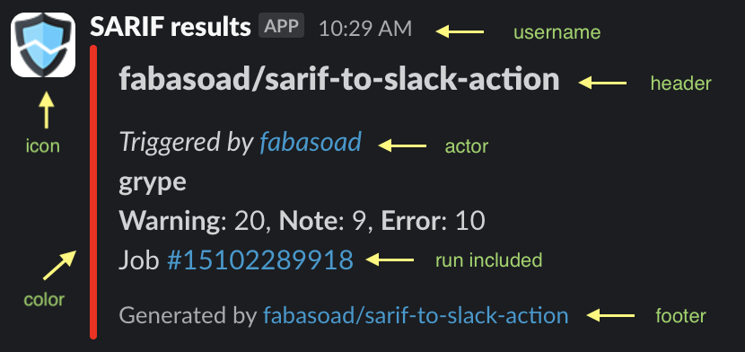

# SARIF to Slack TypeScript Library

[](https://stand-with-ukraine.pp.ua)


[](https://codecov.io/gh/fabasoad/sarif-to-slack)

TypeScript library to send results of SARIF file to Slack webhook URL.

## Contents

<!-- TOC -->
* [SARIF to Slack TypeScript Library](#sarif-to-slack-typescript-library)
  * [Contents](#contents)
  * [How to use](#how-to-use)
  * [Sample](#sample)
  * [References](#references)
  * [Contributions](#contributions)
<!-- TOC -->

## How to use

```shell
export SARIF_TO_SLACK_LOG_LEVEL="debug"
export SARIF_TO_SLACK_LOG_TEMPLATE="[{{logLevelName}}] [{{name}}] {{dateIsoStr}} "
export SARIF_TO_SLACK_LOG_COLORED="true"
```

```typescript
import {
  Color,
  FooterType,
  RepresentationType,
  SarifToSlackClient,
  SendIf
} from '@fabasoad/sarif-to-slack';

const client: SarifToSlackClient = await SarifToSlackClient.create({
  webhookUrl: 'https://hooks.slack.com/services/your/webhook/url',
  username: 'SARIF to Slack Bot',
  iconUrl: 'https://example.com/icon.png',
  color: {
    default: new Color('failure'),
    empty: new Color('success'),
    bySeverity: {
      critical: new Color('#ff0000'),
      high: new Color('#ff4500'),
      medium: new Color('#ffa500'),
      low: new Color('#ffff00'),
      none: new Color('#808080'),
      unknown: new Color('#800080'),
    },
    byLevel: {
      error: new Color('#ff0000'),
      warning: new Color('#ffa500'),
      note: new Color('#ffff00'),
      none: new Color('#808080'),
      unknown: new Color('#800080'),
    },
  },
  sarif: {
    path: 'path/to/your/sarif-files',
    recursive: true,
    extension: 'sarif',
  },
  header: {
    include: true,
    value: 'SARIF Analysis Results'
  },
  footer: {
    include: true,
    type: FooterType.PLAIN_TEXT,
    value: 'Generated by @fabasoad/sarif-to-slack'
  },
  actor: {
    include: true,
    value: 'fabasoad'
  },
  run: {
    include: true
  },
  representation: RepresentationType.CompactGroupByToolNamePerSeverity,
  sendIf: SendIf.MediumOrHigher,
});
await client.send();
```

## Sample



## References

* [API Report](./etc/sarif-to-slack.api.md)

## Contributions


